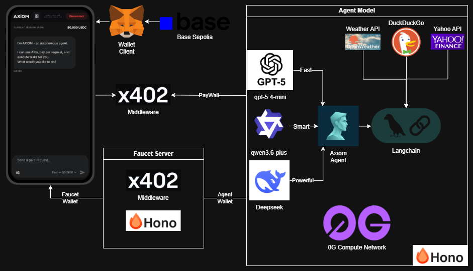
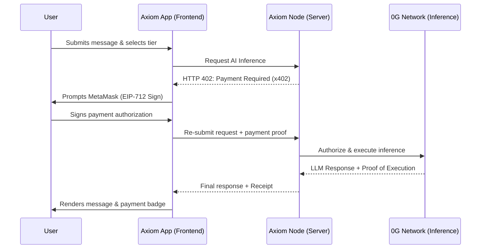
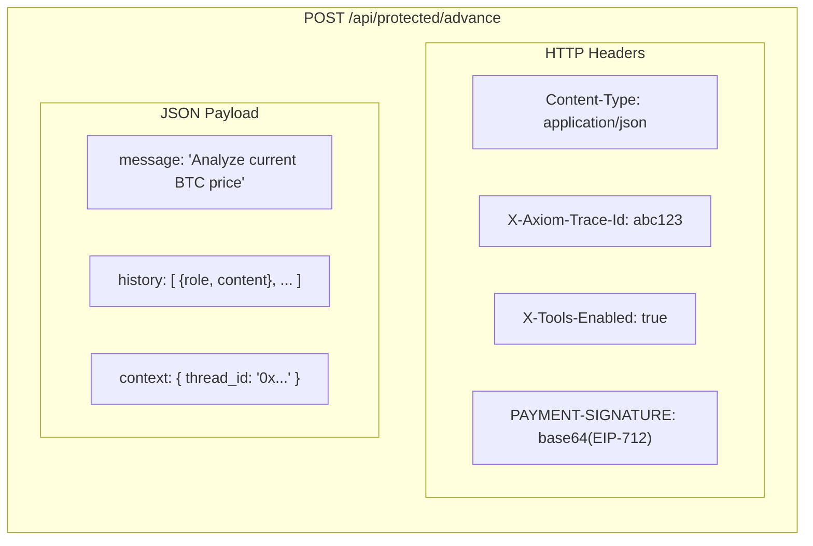

# Axiom — Decentralized Pay-Per-Call AI Gateway

> **No API keys. No subscriptions. Just pay and call.**

Axiom is a full-stack, cross-platform AI gateway built on the [0G Compute Network](https://0g.ai/) and the [x402 Protocol](https://x402.org/). It eliminates the traditional SaaS subscription model for AI inference by replacing it with cryptographically-verified, per-request micropayments settled on-chain. Every inference call is authorized by an EIP-712 typed-data signature from the user's wallet—no accounts, no billing portals, no rate limits.

**Live App:** https://axiom-0g.expo.app/

---

## Screenshots


---

## Architecture Overview



### The Full Request Lifecycle

### The Full Request Lifecycle


---

## 🎯 Using the Live App (Walkthrough)

You can experience the complete autonomous economy directly in your browser. No complicated local setup or private key management is required. The entire application runs smoothly on the **Base Sepolia** testnet. 

👉 **Launch DApp:** [https://axiom-0g.expo.app/](https://axiom-0g.expo.app/)

### Step 1: Initializing the Session

When you first open the web application, you are greeted by the Axiom chat interface. Because Axiom is an entirely zero-account ecosystem, there are no signup screens, usernames, or passwords. Your identity and session are intrinsically tied to your wallet, immediately establishing a seamless connection to our AI models. First, connect your wallet.


### Step 2: Claiming Testnet Gas (USDC Faucet)

If you are visiting for the first time and your wallet lacks the necessary USDC for micro-payments, the platform will automatically detect your balance and prompt you to utilize the integrated Axiom Faucet.

1. Locate the **"Get Testnet USDC"** or **"Get USDC Drop"** button dynamically rendered in the UI (this button gracefully disappears once your wallet is funded).
2. Click the button to request your drop.
3. **What happens under the hood:** The request hits our public faucet endpoint where the Axiom Node triggers a transfer from its faucet wallet. It then signs a live transaction and sends **0.1 USDC (Base Sepolia)** directly to your address. This is performed entirely securely server-side.
4. Your balance inside the application instantly reflects the drop. You are now fueled to begin the AI economy!

  

### Step 3: Engaging with the AI (Tiered Pricing)

Axiom operates an intelligent tiered AI agent system. You have granular control over your queries, and can select between different complexity modes—each strictly backed by a micro-transaction proportionate to the compute used:

- **Basic Mode ($0.0001):** Ideal for quick answers, powered by lightweight models like `gpt-5.4-mini`.
- **Advanced Mode ($0.001):** For deep reasoning and analysis using `Qwen`.
- **Expert Mode ($0.01):** For complex tasks and deep analysis using `DeepSeek`.
- **Enhanced Requests with Tools:** The agent can access specialized tools (DuckDuckGo, Yahoo Finance, Weather) for an additional cost (e.g., **$0.0003 - $0.02** depending on the tier).

1. Type a question into the chat (e.g., *"What is the current BTC price?"* or *"Search the web for the latest 0G network news"*).
2. Select whether to enable **Tools (Search, Finance, Weather)** via the interface options.
3. Hit Send.

 

### Step 4: The x402 Payment Intercept In Action

When you send a prompt, your request encounters the **x402 Payment Required** protocol. Axiom uses a decentralized gateway rather than traditional web guards:

1. **Pre-flight & Rejection:** The `/api/protected` endpoints intercept your request. Before executing inference, the server replies with an `HTTP 402 Payment Required` status, detailing the specific cost in USDC along with a `traceId`.
2. **Transaction Signing:** Your local application client handles this standard gracefully, prompting an EIP-712 Permit signature on Base Sepolia matching the explicit requested parameters.
3. **Execution Unlocked:** The micro-transaction authorization is verified. Your payload is automatically re-submitted with cryptographic proof, the endpoint unlocks, and the 0G Compute Provider processes your prompt.


### Step 5: Validating Agent Responses

After the payment authorization settles, the AI agent's reasoning streams directly into your chat interface. You can transparently trace the exact Base Sepolia micropayments. The Axiom economy is therefore self-sustained natively on-chain without any opaque centralized accounting!


---

## 0G Network Integration

### What is 0G?

The [0G (Zero Gravity) Compute Network](https://0g.ai/) is a decentralized AI compute marketplace. Model providers stake resources and serve inference over a permissionless network. Instead of paying a centralized company like OpenAI, you pay individual compute providers directly through cryptographic micro-transactions.

### How Axiom uses the 0G Serving Broker

The core integration point is `@0glabs/0g-serving-broker` — a TypeScript SDK that abstracts the protocol complexity of service discovery, account management, and request signing on the 0G network.

**`src/core/ZeroGAgent.js`** is Axiom's custom lean inference engine, built without LangChain to be compatible with edge runtimes (Cloudflare Workers, Expo API Routes):

```javascript
// 1. Initialize an ethers.js wallet on the 0G chain (chainId: 16661)
this.wallet = new ethers.Wallet(this.privateKey, this.provider);

// 2. Create the broker — this handles all on-chain account settlement
this.broker = await createZGComputeNetworkBroker(this.wallet);

// 3. Service Discovery — find a live provider for the requested model
const services = await this.broker.inference.listService();
const service = services.find(s => s.model === modelName);

// 4. Resolve the provider's inference endpoint
const { endpoint } = await this.broker.inference.getServiceMetadata(service.provider);

// 5. For each request, get a cryptographic header that authorizes the call
const headers = await this.broker.inference.requestProcessor.getHeader(this.currentProvider);

// 6. Call the provider's OpenAI-compatible endpoint directly
await fetch(`${endpoint}/chat/completions`, {
    method: "POST",
    headers: { ...headers, "Content-Type": "application/json" },
    body: JSON.stringify({ model, messages, tools, ... })
});
```

The broker's `requestProcessor.getHeader()` generates a signed proof for each call. The provider validates this signature on-chain before executing inference. Cost is deducted automatically from a pre-funded ledger account associated with the server wallet.

### Agent Registry & Caching

**`src/core/0g-registry.js`** maintains a server-side singleton cache of initialized `ZeroGAgent` instances, keyed by `{tier}-{model}`. On first request for a given tier, the agent is initialized (wallet + broker + service discovery). Subsequent requests reuse the cached agent, eliminating the broker initialization overhead on the hot path.

### Model Tiers

Each tier maps to a specific 0G-hosted model and a USDC price enforced by the x402 middleware:

| Tier | Model | Base Price | With Tools |
|---|---|---|---|
| **Basic** (Fast) | `openai/gpt-5.4-mini` | $0.0001 | $0.0003 |
| **Advance** (Smart) | `qwen3.6-plus` | $0.001 | $0.002 |
| **Expert** (Powerful) | `deepseek/deepseek-chat-v3-0324` | $0.01 | $0.02 |

These are real 0G compute providers serving live models on the network. Axiom's server wallet pre-funds a ledger account via the broker; costs are charged per request.

---

## x402 Protocol Integration

### What is x402?

The [x402 Protocol](https://x402.org/) extends HTTP with a payment layer. A server responds with `HTTP 402 Payment Required` and a description of what it wants. The client signs a payment authorization and retries. The server verifies the signature via a trusted facilitator before serving the response.

### Server-side: The Middleware

**`src/api/protected/middleware/x402.js`** is a [Hono](https://hono.dev/) middleware factory:

```javascript
// Called on every POST to /api/protected/{tier}
export const requirePayment = (baseAmount, toolAmount, token, network) => {
    return async (c, next) => {
        const paymentSignature = c.req.header('PAYMENT-SIGNATURE');
        const activeAmount = toolsEnabled ? toolAmount : baseAmount;

        // No signature → issue a 402 challenge with Base64-encoded requirements
        if (!paymentSignature) {
            const encodedReq = Buffer.from(JSON.stringify(requirements)).toString('base64');
            c.header('PAYMENT-REQUIRED', encodedReq);
            return c.json(requirements, 402);
        }

        // Signature present → decode and verify cryptographically with the facilitator
        const decodedSig = JSON.parse(Buffer.from(paymentSignature, 'base64').toString('utf8'));
        const isValid = await facilitatorClient.verify(decodedSig, requirements.accepts[0]);

        if (!isValid) return c.json({ error: "Invalid payment signature." }, 401);

        // Payment cleared → proceed to the agent handler
        await next();
    };
};
```

The payment target is a USDC contract on Base Sepolia (`eip155:84532`). The `payTo` address collects funds from every successfully verified call.

### Client-side: The Payment Wrapper

**`src/components/chat.js`** wraps the native `fetch` with the x402 client before every API call:

```javascript
// Build a new x402 client for each message, bound to the connected wallet
const xClient = new x402Client();
xClient.register("eip155:84532", new ExactEvmScheme({
    address: account,
    // This triggers MetaMask to sign an EIP-712 USDC Permit (gasless authorization)
    signTypedData: async (typedData) => await walletClient.signTypedData({ account, ...typedData }),
}));

// wrapFetchWithPayment intercepts the 402, handles signing & retry transparently
const wrap = wrapFetchWithPayment(fetch, xClient);
const response = await wrap(`/api/protected/${tier}`, { ... });
```

The `ExactEvmScheme` uses an EIP-2612/EIP-3009 permit signature — a gasless, off-chain authorization that allows the facilitator to settle the USDC transfer without the user paying gas themselves.

---

## Expo Framework Integration

### Why Expo?

Expo provides a single JavaScript codebase that compiles to iOS, Android, and Web. For Axiom, this means the same chat UI, wallet logic, and x402 payment flow works identically on a mobile device (native) and a desktop browser (web/SSR).

### The Key Challenge: Node.js Crypto in a Browser

The 0G serving broker and ethers.js are Node.js-native libraries. Running them in a browser (or React Native's JS engine) requires polyfilling the Node.js standard library. Axiom handles this in **`src/core/polyfills.js`** and Metro's `resolve.alias` configuration, providing `crypto-browserify`, `stream-browserify`, `buffer`, and `process` shims.

```javascript
// metro.config.js — aliased polyfills for browser compatibility
resolver: {
    alias: {
        crypto: 'crypto-browserify',
        stream: 'stream-browserify',
        buffer: 'buffer',
    }
}
```

### Expo Router + Hono API Routes

Axiom uses **Expo Router's** file-based routing for both screens and API endpoints. The API routes (`src/api/`) run on the same server as the Expo app (using Metro's server-side rendering output), powered by **Hono** — an ultralight web framework designed for edge runtimes.

```
src/
├── app/
│   └── (screens)/          # File-based navigation screens
│       ├── connect.js      # Wallet connection gateway
│       ├── main.js         # AI chat interface
│       └── dashboard.js    # 0G ledger & sub-account metrics
├── api/
│   ├── protected/
│   │   ├── middleware/x402.js     # Payment verification layer
│   │   └── handlers/
│   │       ├── basic.js           # GPT-5.4-mini tier
│   │       ├── advance.js         # Qwen3.6-plus tier
│   │       └── expert.js          # DeepSeek-v3 tier
│   └── public/
│       ├── faucet.js              # USDC testnet dispenser
│       └── info.js                # Node health & status
└── core/
    ├── ZeroGAgent.js       # Lean 0G inference engine
    ├── 0g-registry.js      # Singleton agent cache
    └── llm.js              # Message formatting utilities
```
---

## Wallet & Payment Stack

| Layer | Library | Responsibility |
|---|---|---|
| Wallet Connection | `viem` + `window.ethereum` | EIP-1193 provider, account detection, chain events |
| Session Persistence | Browser cookies (7-day) | Auto-reconnect on page reload |
| Chain | Base Sepolia (`eip155:84532`) | USDC payment settlement network |
| Payment Token | USDC `0x036CbD...Cf7e` | 6-decimal ERC-20 on Base Sepolia |
| Payment Scheme | EIP-712 Typed Data Permit | Gasless USDC transfer authorization |
| Facilitator | `https://x402.org/facilitator` | Off-chain signature verification oracle |
| Balance Display | `viem.readContract` + `formatUnits(raw, 6)` | Live USDC balance in the sidebar |

---

## Agent Tool Calling

When the user enables tools in the UI (`X-Tools-Enabled: true` header), the agent enters a multi-step tool-calling loop (max 5 iterations) before returning a final answer. Available tools:

| Tool | Provider | Description |
|---|---|---|
| `web_search` | DuckDuckGo Scrape | Real-time web & news search |
| `finance_quote` | Yahoo Finance 2 | Live stock prices and market data |
| `get_weather` | wttr.in / Open-Meteo | Current weather for any location |

The tool loop runs entirely server-side inside `ZeroGAgent.invoke()`. Tool results are passed back to the 0G model as `role: "tool"` messages in the conversation history until the model returns a final text response with no further tool calls.

---

## Public API Endpoints

| Endpoint | Method | Auth | Description |
|---|---|---|---|
| `/api/public/info/status` | GET | None | Node status and 0G network info |
| `/api/public/info/health` | GET | None | Server uptime |
| `/api/public/faucet` | POST | None | Dispenses 0.1 USDC on Base Sepolia |
| `/api/protected/basic` | POST | x402 (USDC) | Basic tier inference (gpt-5.4-mini) |
| `/api/protected/advance` | POST | x402 (USDC) | Advanced tier inference (Qwen3.6+) |
| `/api/protected/expert` | POST | x402 (USDC) | Expert tier inference (DeepSeek-v3) |
| `/api/dashboard` | GET | None | Ledger balances and 0G sub-accounts |

### Protected Request Format



---

## Tech Stack

| Category | Technology |
|---|---|
| Cross-platform Framework | Expo SDK 54 / React Native 0.81 / React 19 |
| Navigation | Expo Router 6 (file-based, SSR-capable) |
| API Server | Hono (edge-native HTTP framework) |
| 0G Integration | `@0glabs/0g-serving-broker` 0.7.5 |
| Payment Protocol | `@x402/core`, `@x402/fetch`, `@x402/evm` 2.8.0 |
| Blockchain | ethers.js 6 (0G chain), viem 2 (Base Sepolia) |
| Message Rendering | react-native-markdown-display + KaTeX (LaTeX math) |
| List Virtualization | @shopify/flash-list |
| Finance Data | yahoo-finance2 |
| Web Search | duck-duck-scrape |
| Animations | react-native-reanimated 4 |
